# ResNet-50-Federated-Learning

## Overview
This repo deals with federating learning training for resnet50 on [CIFAR-10](https://www.cs.toronto.edu/~kriz/cifar.html) dataset.  

## Setup(wsl)
pre requirements:
- wsl (official installation stepscould be found here)

If you are running using a gpu install cuda on your wsl machine the official steps could be found [here](https://developer.nvidia.com/cuda-13-0-0-download-archive?target_os=Linux&target_arch=x86_64&Distribution=WSL-Ubuntu&target_version=2.0&target_type=deb_local) Note: check if 13.0 is supported for your gpu.  
Next clone the repo using:
```bash
git clone git@github.com:AbbasDagg/ResNet-50-Federated-Learning.git
```
then install the requirements using:
```bash
pip install -r requirements.txt
```
**Note** if you are running with cuda you may need to install torch with cuda, check the oficial [website](https://pytorch.org/get-started/locally/) for more info.

## Running & Viewing Results

### Federated Learning Training

To run the federated learning training with the default configuration:
```bash
python federated_learning/fl_job.py --config runs/server_client_default.yaml
```

To run with a custom configuration:
```bash
python federated_learning/fl_job.py --config runs/custom_config.yaml
```

### Monitoring Training Progress

View raining metrics using TensorBoard:
```bash
tensorboard --logdir=<run_path>/tensorboard_logs/ --bind_all
```

Then open your browser and navigate to `http://localhost:6006` to visualize training metrics.

**Example:**
```bash
tensorboard --logdir=workspace/server_client_default_20260125_1617/tensorboard_logs/ --bind_all
```


When you open TensorBoard, you will see something like this:

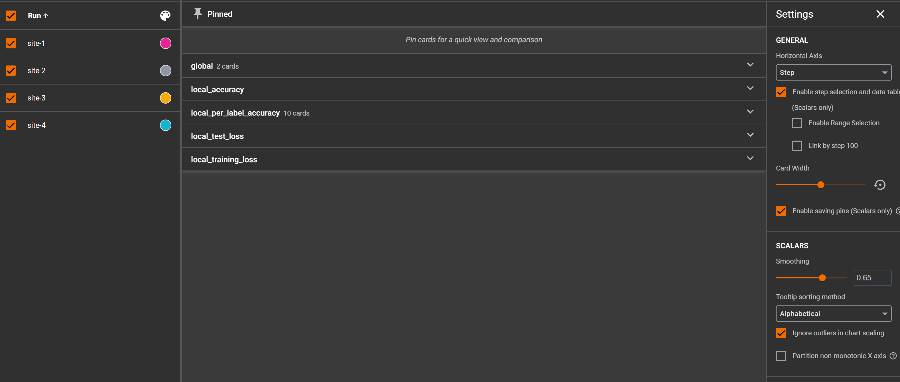

Then, pick the site you want to view the metrics with and you are good to go. Moreover, you can pick multiple sites to compare with by enabling the checkboxes of the wanted sites.

## Config

Our federated learning system is configured using one YAML file. The configuration controls server-side aggregation settings and client-side training parameters making.
This configuration make it easier to run the federated learning runs with different parameters.

### Configuration Structure

The config file must contain:
- **Server settings**: Number of rounds and aggregation method
- **Client settings**: Training hyperparameters for each client

### Server Configuration

| Parameter | Type | Description |
|-----------|------|-------------|
| `num_rounds` | int | Number of federated learning training rounds |
| `aggregation_method` | string | Method for aggregating client models (default: `fedavg`) |

**Supported Aggregation Methods:**
- `fedavg` - Federated Averaging (default)

### Client Configuration

Each client in the system has the following configurable parameters:

| Parameter | Type | Default | Description |
|-----------|------|---------|-------------|
| `lr` | float | 0.03 | Learning rate for client training |
| `epochs` | int | 6 | Number of local epochs per round |
| `batch_size` | int | 64 | Batch size for training |
| `use_lr_scheduler` | bool | true | Whether to use learning rate scheduler |
| `lr_min` | float | 0.001 | Minimum learning rate (when using scheduler) |

### Example Configuration File

```yaml
server:
  num_rounds: 10
  aggregation_method: fedavg
  clients:
    site-1:
      lr: 0.03
      epochs: 5
      batch_size: 64
      use_lr_scheduler: true
      lr_min: 0.001
    site-2:
      lr: 0.03
      epochs: 6
      batch_size: 64
      use_lr_scheduler: true
      lr_min: 0.001
    site-3:
      lr: 0.01
      epochs: 3
      batch_size: 64
      use_lr_scheduler: true
      lr_min: 0.001
    site-4:
      lr: 0.1
      epochs: 6
      batch_size: 128
      use_lr_scheduler: false
      lr_min: 0.01
```

A default config will look like this (using defaults):

```yaml
server:
  num_rounds: 10
  aggregation_method: "fedavg"
  clients:
    client_1: {}
    client_2: {}
    client_3: {}  
    client_4: {}
```


## arcuticture:
# TODO describe flow
### Data Distribution

The data is automatically split and distributed across clients using the `split_data.py` script. The splitting process:
- Splits CIFAR-10 training data (50,000 samples) equally among clients
- Ensures deterministic distribution by class labels
- Each client receives a balanced subset of all 10 classes
- The test set (10,000 samples) is shared for evaluation

## Results:
In our run we were able to get to 90% accuracy and here are the training metrics and results:

### Global Model Performance

**Global Model Accuracy:**  

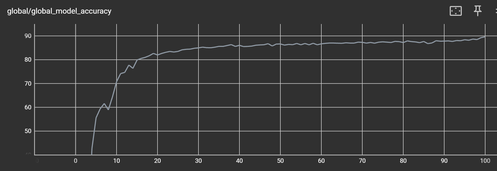


**Global Model Loss:**  

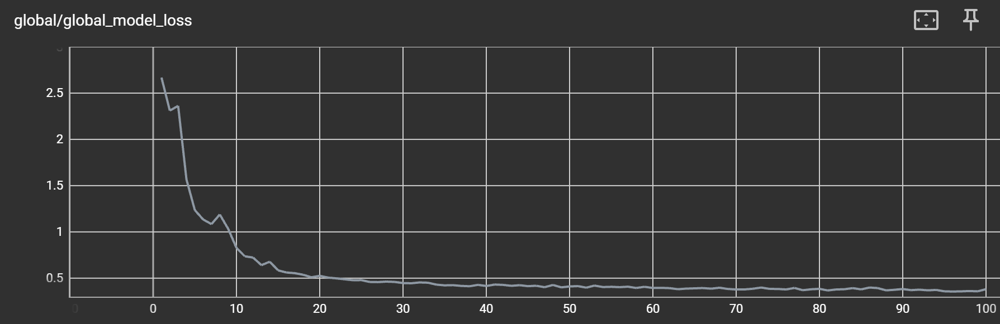

### Site-1 Local Training Results

**Site-1 Local Accuracy:**  

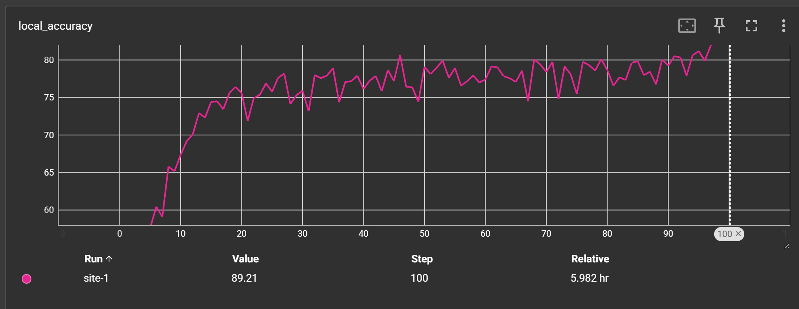


**Site-1 Training Loss:**  

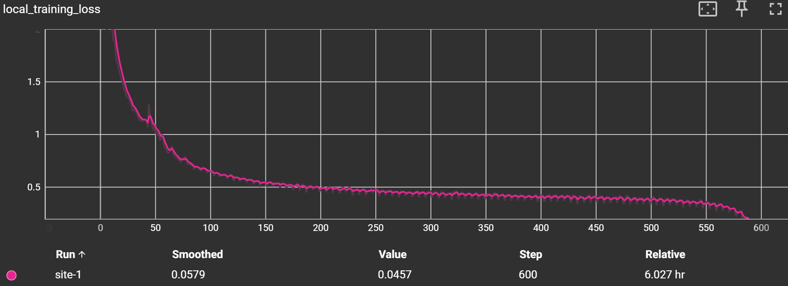

**Site-1 Test Loss:**  

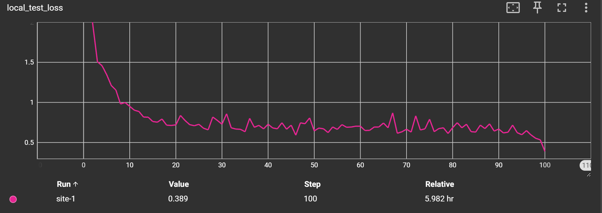


### Site-1 Class-wise Accuracy

| Class 0 | Class 1 | Class 2 |
|---------|---------|---------|
| 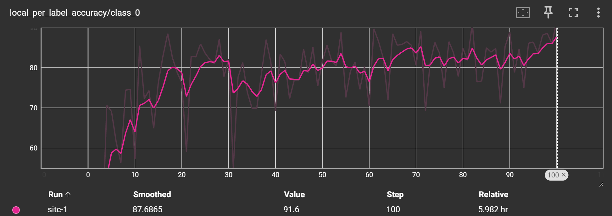 | 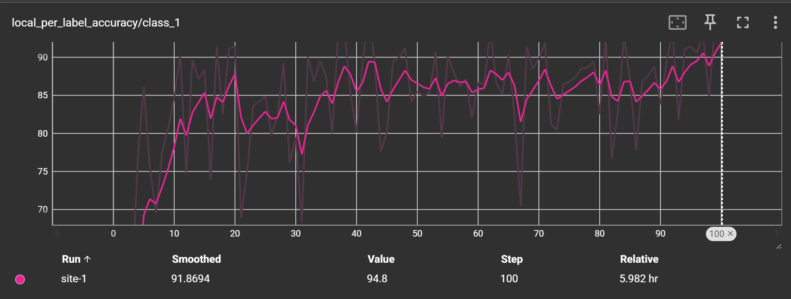 | 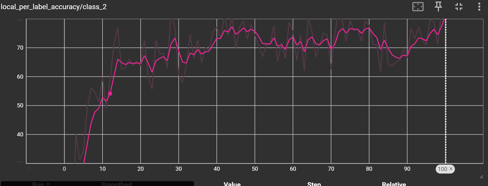 |

| Class 3 | Class 4 | Class 5 |
|---------|---------|---------|
|  | 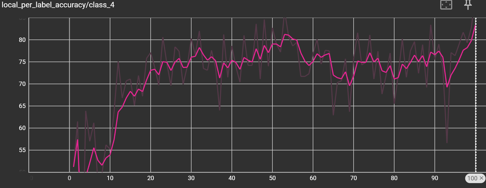 | 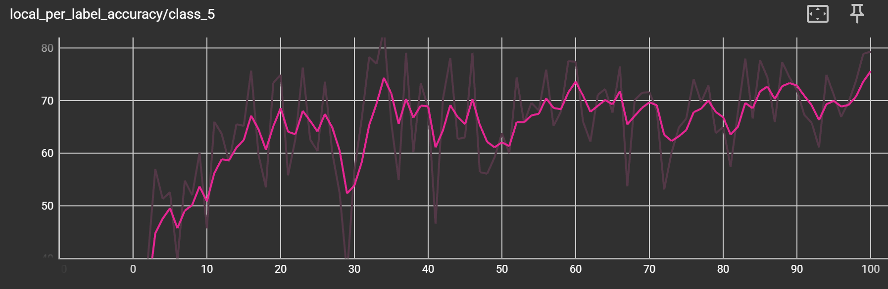 |

| Class 6 | Class 7 | Class 8 |
|---------|---------|---------|
| 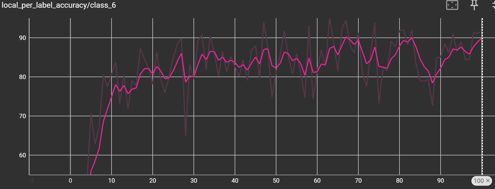 | 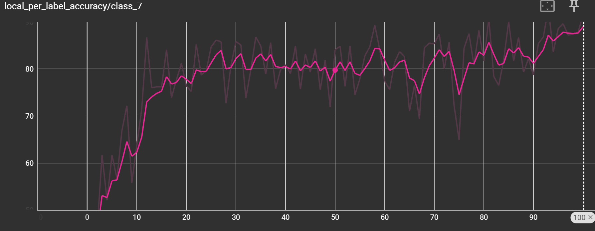 |  |

| Class 9 |
|---------|
| <div style="text-align: center;">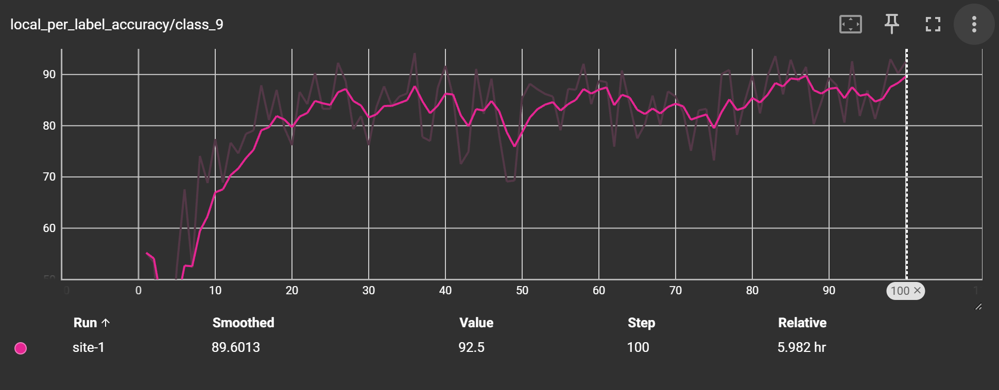</div> |


### Visualise the full results of the run:
To see the full resutls for all of the sites with all of the metrics run the following:

```bash
tensorboard --logdir=results/tensorboard_logs/ --bind_all
```

## Contributors:
**Sami Serhan** - samii.serhan@gmail.com
**Abbas Ismail** - abbasismail172@gmail.com
